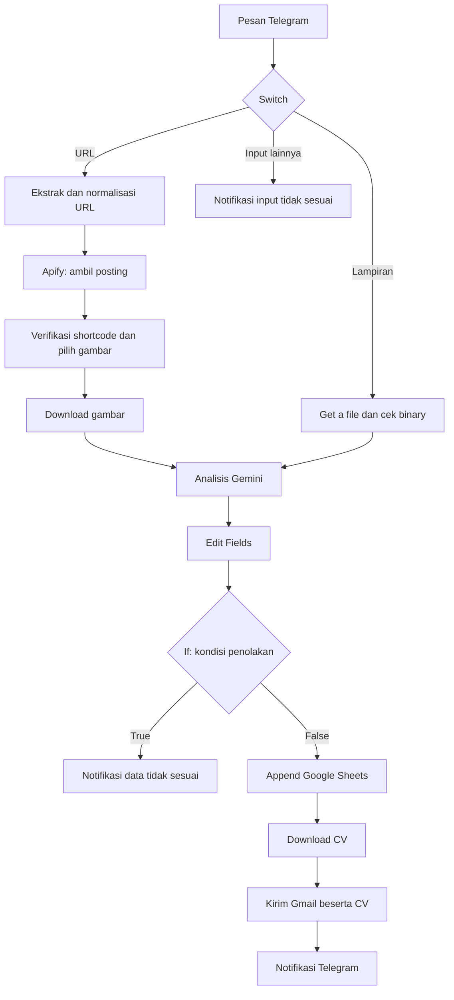

# finalproject-ppkd-n8n
JobSeeker 1.2 (Automation Apply Jobs for Jobseeker)

# JobSeeker — Automated Job Apply for Job Seekers

Workflow n8n untuk membantu pencari kerja memproses lamaran melalui Telegram. Pengguna mengirim poster lowongan atau URL posting Instagram, kemudian workflow mengekstrak informasi menggunakan Gemini, mencatatnya ke Google Sheets, mengunduh CV dari Google Drive, mengirim email melalui Gmail, dan memberikan notifikasi melalui Telegram.

Dokumentasi ini disusun berdasarkan `JobSeeker 1.2.json` dengan nama workflow **JobSeeker 1.2**. Pemeriksaan dilakukan terhadap konfigurasi JSON; integrasi layanan dan pengiriman email belum diuji langsung.

> **Sebelum digunakan:** ekspor sumber memuat token Apify secara langsung pada URL request. Cabut/ganti token tersebut, hapus parameter token dari URL, dan simpan token pengganti di Credentials n8n sebelum membagikan workflow. Nilai token tidak dicantumkan dalam README ini.

## 1. Latar Belakang dan Tujuan

Melamar pekerjaan melalui email biasanya membutuhkan beberapa langkah manual: membaca poster, menyalin alamat HR, menyusun email, melampirkan CV, dan mencatat riwayat lamaran. JobSeeker mengotomatisasi rangkaian tersebut melalui satu jalur input Telegram.

Tujuan proyek:

- Mempermudah pemrosesan lowongan dari poster dan posting Instagram.
- Mengurangi penyalinan data dan penulisan email berulang.
- Menggunakan CV yang tersimpan pada Google Drive.
- Menyediakan rekap data lowongan dan notifikasi hasil pengiriman.

Target pengguna adalah pencari kerja, dengan template email sumber yang berfokus pada latar belakang administrasi proyek IT dan workflow automation. Besarnya penghematan waktu perlu dibuktikan melalui pengukuran; file workflow tidak memuat hasil pengukuran ROI.

## 2. Cakupan dan Batasan

| Komponen | Perilaku pada workflow saat ini |
|---|---|
| Input utama | Pesan Telegram berupa foto/lampiran atau URL posting Instagram |
| URL Instagram | Jalur posting `/p/`, termasuk URL dengan username sebelum `/p/` |
| Jumlah URL | Gunakan satu URL per pesan; beberapa URL dalam satu pesan tidak diproses seluruhnya |
| Carousel Instagram | Gambar dipisahkan menjadi item; slide video dilewati |
| Dokumen PDF | Diteruskan melalui jalur dokumen ke Gemini; kompatibilitas file/model perlu diuji |
| Jenis media lain | Switch juga menerima video, audio, voice, animasi, video note, dan stiker, tetapi analisis berikutnya berorientasi dokumen/gambar |
| Ekstraksi | Nama perusahaan, posisi, email HR, ID transaksi, dan keterangan diminta dalam prompt |
| Rekap Sheets | Hanya tanggal, nama perusahaan, posisi, dan email HR yang disimpan |
| Pengiriman | Email langsung dikirim setelah melewati cabang validasi; belum ada persetujuan pengguna |
| Profil pelamar | Satu CV dan identitas pengirim yang dikonfigurasi pada workflow |

Workflow belum memisahkan setiap posisi menjadi lamaran individual, belum mencegah lamaran duplikat, dan belum memilih CV berdasarkan pengguna Telegram. Beberapa email HR digabung dengan koma menjadi satu nilai penerima; ini bukan mekanisme pengiriman terpisah per HR.

## 3. Diagram Alur



Cabang `False` pada node `If` merupakan jalur menuju pengiriman. Kondisi penolakan yang ada masih terbatas; lihat bagian temuan sebelum mengaktifkan pengiriman sebenarnya.

## 4. Daftar Node dan Fungsi

| Node | Fungsi |
|---|---|
| Upload Sumber Lowongan | Telegram Trigger untuk menerima update `message`; download pada trigger dinonaktifkan |
| Switch | Memisahkan URL, lampiran, dan input lainnya; lampiran lebih diprioritaskan ketika pesan juga memuat URL |
| Input URL | Mengambil posting Instagram dari teks, caption, hyperlink, atau preview |
| Normalisasi URL | Membentuk `https://www.instagram.com/p/SHORTCODE/` dan menyimpan shortcode |
| Ambil Media Instagram | Menjalankan actor Apify `apify~instagram-scraper` dengan satu direct URL |
| Pilih Gambar | Memastikan shortcode hasil sesuai input, melewati video, dan mengeluarkan item gambar |
| Download Gambar | Mengunduh `image_url` sebagai file binary yang diharapkan bernama `data` |
| Get a file | Memilih `file_id` dokumen atau foto beresolusi terbesar, dengan fallback jenis media lain |
| Cek Binary File (Gambar) | Memastikan `binary.data` tersedia; tidak memvalidasi MIME type atau isi gambar |
| Analyze Document Photo/File | Mengirim binary `data` dan prompt ekstraksi ke Gemini |
| Edit Fields | Parse JSON AI, merapikan nama perusahaan, menggabungkan array, dan menambahkan tanggal WIB |
| If | Memeriksa kondisi penolakan berdasarkan nama perusahaan dan email |
| Rekap Lamaran Kerja | Menambahkan baris ke Google Sheets dengan operasi `append` |
| Download CV | Mengunduh satu CV yang dipilih pada Google Drive ke binary `data` |
| Kirim Lamaran Kerja + CV | Mengirim email Gmail menggunakan informasi lowongan dan lampiran |
| Info Lamaran Kerja Terkirim | Mengirim konfirmasi ke chat Telegram sumber setelah node Gmail berhasil |
| Info Data Salah1 | Memberi respons untuk fallback Switch |
| Info Data Salah2 | Memberi respons ketika kondisi penolakan `If` bernilai true |
| Catatan Perbaikan URL Dinamis | Sticky note berisi latar belakang dan deskripsi proyek; tidak mengeksekusi proses |

## 5. Kebutuhan Awal

- Instance n8n yang mendukung jenis dan versi node pada file impor, termasuk node Google Gemini.
- Bot Telegram dan credential token bot.
- API key Gemini serta akses ke model yang akan digunakan.
- Akun Apify dengan akses actor Instagram Scraper dan kuota yang cukup.
- Credential Google Sheets, Google Drive, dan Gmail dengan akses ke sumber daya terkait.
- Spreadsheet tujuan dan CV PDF pada Google Drive.

Nomor versi aplikasi n8n tidak tercantum dalam ekspor. Nilai `typeVersion` pada node bukan versi instalasi n8n.

## 6. Impor dan Konfigurasi

### 6.1 Impor workflow

1. Impor file `JobSeeker 1.2(1).json` melalui fitur import workflow n8n.
2. Gunakan salinan workflow untuk konfigurasi dan pengujian.
3. Pastikan workflow belum aktif untuk pemakaian nyata selama penyesuaian. File sumber mencatat `active: true`; verifikasi status setelah impor.
4. Pilih ulang credentials setiap layanan. Referensi ID credential dalam JSON tidak menyediakan akses ke akun pembuat workflow.
5. Sesuaikan spreadsheet, file CV, identitas pengirim, dan penerima BCC.

### 6.2 Telegram

Gunakan credential bot yang sesuai pada trigger, `Get a file`, dan seluruh node notifikasi Telegram.

- Trigger menerima update `message`.
- Pada `Get a file`, pastikan opsi download aktif dan output memiliki **Binary → data**. Parameter download tidak ditulis eksplisit dalam ekspor node ini, sehingga perlu diperiksa setelah impor.
- `Cek Binary File (Gambar)` akan berhenti jika properti tersebut tidak tersedia.
- ID chat notifikasi merujuk ke pesan yang diterima oleh `Upload Sumber Lowongan`.

### 6.3 Apify

Pada `Ambil Media Instagram`, gunakan metode `POST` dan URL tanpa token:

```text
https://api.apify.com/v2/actors/apify~instagram-scraper/run-sync-get-dataset-items
```

Gunakan credential **Header Auth**:

| Field | Nilai |
|---|---|
| Name | `Authorization` |
| Value | `Bearer TOKEN_APIFY_BARU` |

`TOKEN_APIFY_BARU` adalah placeholder. Simpan nilai sebenarnya hanya di credential. Header Bearer didukung oleh [dokumentasi API Apify](https://docs.apify.com/api/v2).

Body JSON dalam mode Expression mengikuti file sumber:

```javascript
{{ {
  directUrls: [$json.instagram_url],
  resultsType: "posts",
  resultsLimit: 1
} }}
```

Timeout request pada ekspor adalah `320000` ms. `Pilih Gambar` memverifikasi shortcode untuk mencegah gambar dari posting lain diteruskan.

### 6.4 Gemini

Konfigurasi yang tersimpan:

| Parameter | Nilai |
|---|---|
| Resource | `document` |
| Model ID | `models/gemini-3.1-flash-lite` |
| Input Type | `binary` |
| Input Binary Field | `data` |
| Simplify | `false` |
| Retry on Fail | Aktif, maksimum 5 percobaan |

Model ID di atas adalah nilai dari file, bukan jaminan ketersediaan pada akun lain. Pilih model yang tersedia dan mendukung input yang digunakan; periksa kembali struktur respons jika model atau pengaturan berubah.

`Edit Fields` saat ini membaca teks hasil dari:

```javascript
$json.candidates[0].content.parts[0].text
```

Contoh struktur JSON yang diminta prompt, menggunakan data fiktif:

```json
{
  "id_transaksi": "20261001-A1B2C",
  "nama_perusahaan": "PT. Contoh Sejahtera",
  "posisi_yang_dibuka": ["Staff Administrasi"],
  "email_hr": ["hr@example.com"],
  "keterangan": ""
}
```

Prompt memperbolehkan caption pengirim mengoreksi informasi poster. Caption diambil dari `message.caption`, bukan seluruh teks pesan URL. ID transaksi diminta dari AI tetapi tidak diteruskan ke Sheets; keunikannya belum dijamin oleh kode.

### 6.5 Google Sheets

Pilih spreadsheet tujuan pada `Rekap Lamaran Kerja`. Nama sumber adalah **History Lamaran Kerja**, dengan tab **JobSeeker**. Buat header berikut agar sesuai mapping:

| Header Sheets | Sumber dari Edit Fields | Contoh |
|---|---|---|
| `tanggal` | `tanggal` | `2026-10-01` |
| `nama_perusahaan` | `Nama Perusahaan` | `PT. Contoh Sejahtera` |
| `posisi` | `Posisi` | `Staff Administrasi` |
| `email_hr` | `Email` | `hr@example.com` |

Tanggal menggunakan ekspresi:

```javascript
{{ $now.setZone('Asia/Jakarta').toFormat('yyyy-MM-dd') }}
```

Nama perusahaan diubah ke kapital awal kata, dengan penanganan khusus `PT.` dan `CV.`. Posisi dan email yang berbentuk array digabung menggunakan `join(', ')`.

**Baris Sheets ditambahkan sebelum Gmail dijalankan.** Adanya baris belum membuktikan email berhasil dikirim. Workflow belum menyimpan status pengiriman atau Gmail message ID.

### 6.6 CV dan Gmail

1. Pada `Download CV`, pilih file CV milik pelamar. Sumber menggunakan CV Jayyid Tamam yang ditentukan secara tetap.
2. Pastikan output unduhan CV tersedia sebagai binary `data`.
3. Pada `Kirim Lamaran Kerja + CV`, sesuaikan nama pengirim, identitas pada isi email, subjek, dan BCC. File sumber memuat alamat BCC pribadi yang perlu ditinjau sebelum digunakan pengguna lain.
4. Periksa lampiran Gmail dan set **Attachment Field Name** ke `data`. Entri attachment pada JSON berupa objek kosong sehingga nilai efektif setelah impor perlu dipastikan.
5. Periksa input Gmail: `email_hr`, `posisi`, dan `nama_perusahaan` harus tetap tersedia setelah node unduh CV.

Mapping pada sumber:

```javascript
// Penerima
{{ $json.email_hr }}

// Subjek — sesuaikan identitas pelamar
Lamaran Kerja Jayyid Tamam - {{ $json.posisi }}
```

Isi email menggunakan template tetap dengan nama perusahaan dan posisi dinamis. Workflow hanya mengunduh satu CV; kalimat tentang “dokumen pendukung” pada template perlu disesuaikan jika tidak ada lampiran tambahan.

## 7. Cara Penggunaan

### Mengirim poster

1. Buka chat bot Telegram yang telah dihubungkan.
2. Kirim foto poster atau dokumen yang memuat informasi lowongan dengan jelas.
3. Bila diperlukan, tambahkan caption koreksi, misalnya:

```text
Nama perusahaan: PT. Contoh Sejahtera
Posisi: Staff Administrasi
Email HR: hr@example.com
```

4. Setelah seluruh jalur berhasil, bot mengirim notifikasi pengiriman email.

Caption memiliki prioritas tinggi dalam prompt sumber. Periksa kembali alamat email sebelum mengirim input karena belum ada tahap konfirmasi penerima.

### Mengirim URL Instagram

Kirim satu URL posting dengan format:

```text
https://www.instagram.com/p/SHORTCODE/
```

Ganti `SHORTCODE` dengan kode posting sebenarnya. Gunakan URL lengkap dengan `https://` agar lolos pemeriksaan Switch. Jalur parser belum mendukung Reel, Story, atau halaman profil. Setiap gambar carousel dapat menghasilkan proses lanjutan tersendiri, termasuk email tersendiri; slide belum digabung menjadi satu lowongan.

## 8. Pengujian

**Status seluruh skenario: belum diuji langsung.** Gunakan salinan workflow dan arahkan penerima Gmail ke alamat pengujian milik sendiri. Sesuaikan pula BCC; jangan mengirim ke HR sebenarnya selama pengujian.

| No. | Skenario | Hasil yang perlu diperiksa |
|---|---|---|
| 1 | Poster jelas dengan satu posisi dan email uji | Binary tersedia, JSON terbaca, rekap benar, CV terlampir, notifikasi muncul |
| 2 | URL Instagram posting gambar | Shortcode input sama dengan hasil Apify; gambar sesuai posting |
| 3 | Dua URL berbeda dalam dua pesan berturut-turut | Eksekusi kedua menggunakan posting kedua, bukan hasil sebelumnya |
| 4 | Carousel dengan beberapa gambar | Item per gambar benar; catat jumlah rekap dan email untuk mengidentifikasi pengulangan |
| 5 | Teks biasa tanpa URL/lampiran | Masuk fallback Switch dan `Info Data Salah1` |
| 6 | Poster tanpa alamat email | Pengiriman seharusnya dihentikan; validasi saat ini perlu diperbaiki untuk menjamin hasil ini |
| 7 | Gambar bukan lowongan | Periksa respons AI dan penanganan null; ada risiko gagal pada Edit Fields |
| 8 | PDF lowongan | Pastikan Gemini mampu membaca file dan mengembalikan JSON sesuai skema |
| 9 | CV tidak dapat diakses atau Gmail gagal | Periksa error; baris Sheets mungkin sudah terbentuk tanpa email terkirim |
| 10 | Input yang sama dikirim ulang | Catat potensi baris dan email duplikat karena belum ada deduplikasi |

Simpan bukti berupa input uji, output tiap node, baris Sheets, email uji beserta lampiran, dan notifikasi Telegram. Notifikasi sukses menunjukkan node pengiriman telah berhasil, bukan bukti HR sudah membaca email.

## 9. Temuan dan Perbaikan Sebelum Produksi

Bagian ini mencatat hasil pemeriksaan file. Saran berikut **belum diterapkan pada JSON sumber**.

| Temuan | Dampak | Tindakan yang disarankan |
|---|---|---|
| Token Apify tertulis pada query URL | Secret ikut terbawa ketika JSON dibagikan | Rotasi token, hapus query token, gunakan credential Header Auth |
| Kondisi `If` memakai kombinasi AND | Data dapat lolos jika hanya salah satu field tidak diketahui | Tolak bila salah satu field wajib tidak valid; validasi format dan tujuan email |
| Nilai pembanding perusahaan tersimpan sebagai `=Tidak Diketahui` | Mode/nilai evaluasi perlu dipastikan setelah impor | Periksa nilai Fixed/Expression dan hasil evaluasi; gunakan string pembanding yang jelas |
| Prompt non-lowongan meminta null, sementara `.trim()` mengasumsikan string | Edit Fields dapat gagal sebelum mencapai If | Tambahkan parsing dan pemeriksaan tipe yang aman serta penolakan non-lowongan |
| Instruksi nilai kosong dan tipe array dalam prompt tidak sepenuhnya konsisten | `.join()` dapat gagal jika AI mengembalikan string | Tetapkan skema konsisten dan validasi tipe hasil AI |
| Prompt meminta best-guess pada teks buram | Perusahaan atau email dapat salah dibaca | Hindari tebakan untuk alamat penerima; minta koreksi bila tidak pasti |
| `JSON.parse()` langsung membaca respons AI | Markdown, JSON rusak, atau respons kosong menghentikan workflow | Tambahkan parser terjaga dan jalur pesan kegagalan |
| Switch menerima banyak jenis media | Media yang tidak sesuai tetap mencapai analisis dokumen | Batasi jenis file dan MIME type sesuai cakupan |
| Belum ada deduplikasi atau penggabungan carousel | Satu lowongan dapat memicu beberapa email | Gunakan identitas posting/lowongan dan gabungkan informasi sebelum mengirim |
| Rekap mendahului email | Riwayat belum merepresentasikan hasil pengiriman | Tambahkan status pending/sent/failed dan pembaruan setelah Gmail |
| Belum ada jalur error umum | Error layanan tidak otomatis dilaporkan kepada pengguna | Tambahkan penanganan error dan notifikasi yang sesuai |
| Belum ada pembatasan pengirim Telegram | CV dan akun pengirim tetap digunakan untuk pesan yang mencapai workflow | Batasi user/chat yang diizinkan untuk pemakaian pribadi |

## 10. Troubleshooting

| Gejala | Pemeriksaan |
|---|---|
| `Get a file belum menghasilkan binary.data` | Pastikan lampiran asli dikirim, download aktif, dan properti binary bernama `data` |
| URL ditolak | Gunakan URL lengkap posting Instagram `/p/`; Reel dan Story tidak didukung parser |
| Posting hasil Apify tidak sesuai input | Bandingkan shortcode, gunakan pesan baru, periksa pinned data saat pengujian; ekspor sumber memiliki `pinData` kosong |
| Tidak ada gambar ditemukan | Periksa hasil/log Apify; posting mungkin tidak tersedia atau hanya berisi video |
| Gagal parse JSON atau error `.trim()`/`.join()` | Periksa respons Gemini, tipe field, nilai null, dan kemungkinan Markdown |
| Data tidak masuk Sheets | Periksa credential, hak akses, pilihan tab, dan header kolom |
| Email tanpa CV | Pastikan `Download CV` menghasilkan binary `data` dan attachment Gmail merujuk field tersebut |
| Email gagal tetapi Sheets terisi | Sesuai urutan saat ini, rekap dilakukan terlebih dahulu; periksa eksekusi Gmail |
| Email terkirim berulang | Periksa carousel, input ulang, atau eksekusi ulang; deduplikasi belum tersedia |

## 11. Checklist Pengoperasian

- [ ] Token yang tercantum pada ekspor telah diganti dan dihapus dari URL.
- [ ] Credentials, spreadsheet, file CV, identitas pengirim, dan BCC sudah sesuai.
- [ ] Binary poster dan binary CV telah diverifikasi.
- [ ] Parser AI serta kondisi penolakan sudah diperbaiki dan diuji.
- [ ] Penerima email dan isi lamaran diverifikasi melalui alamat uji sendiri.
- [ ] Perilaku carousel dan input duplikat telah ditangani.
- [ ] Akses Telegram dibatasi sesuai pengguna yang dituju.
- [ ] Status pencatatan dan penanganan kegagalan sudah ditetapkan.
- [ ] Seluruh pengujian yang relevan lulus sebelum workflow diaktifkan untuk lamaran nyata.

## 12. Catatan Publikasi Repository

README ini tidak menyertakan nilai token, ID credential, ID file Drive, maupun ID spreadsheet sumber. Sebelum mengunggah workflow JSON ke repository, periksa dan bersihkan juga file JSON tersebut. Membersihkan README saja tidak menghilangkan secret yang masih ada pada workflow atau riwayat commit.

## Referensi

- File analisis: `JobSeeker 1.2(1).json`.
- [Dokumentasi API Apify — autentikasi](https://docs.apify.com/api/v2).

Dokumentasi menjelaskan konfigurasi yang ditemukan dan kebutuhan penyesuaiannya; keberhasilan operasional harus dibuktikan melalui pengujian akun serta layanan yang digunakan.
